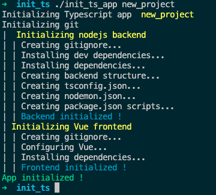
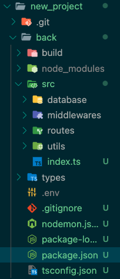

# Create Typescript app

I made this script in order to init a full project faster.
I will maybe update it if needed.

It generate a blank Nodejs Express backend & a blank vue front-end project. See more [here](#project)

Example : 




## Requirements

- Node.js + npm
- git
- [jq](https://stedolan.github.io/jq/)
- vue-cli
- Terminal supporting ansi/vt-100 escape sequences (for display colors)

## Installation & usage

### Linux

Clone the repository :

```git clone git@github.com:FaureAlexis/create-typescript-app.git```

`cd create-typescript-app`

Install requirements (using debian package manager, edit this with your distribution pm):
``sudo apt update;
sudo apt-get install nodejs jq npm;
sudo npm install -g @vue/cli``

Create app : 
`./create-typescript-app project_name`

*Feel free to add script to path in order to call it from everywhere*

### MacOS

Clone the repository :

```git clone git@github.com:FaureAlexis/create-typescript-app.git```

`cd create-typescript-app`

You will need [Homebrew](https://brew.sh/) in order to download packages.

Install requirements (using homebrew):

`brew install nodejs jq npm;
sudo npm install -g @vue/cli`

Create app : 
`./create-typescript-app project_name`

*Feel free to add script to path in order to call it from everywhere*


## <a name="project"></a> Generated project 

### Front-End :

Blank vue app with following configuration:

- Babel
- Typescript
- Vue router (using history)
- Vuex store
- Eslint with Airbnb config
- Jest for unit testing
- Axios

Run front-end (dev): 

`npm run serve`

*App will be available on default port : http://localhost:8080*

### Back-End :

Blank express typescript app with following configuration :

- .env file
-  nodemon (with config file)
-  gitignore
-  tsconfig (es6)
-  dev and production scripts
  
Project back-end look like this :


